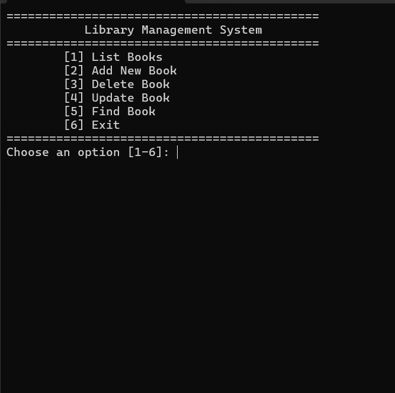
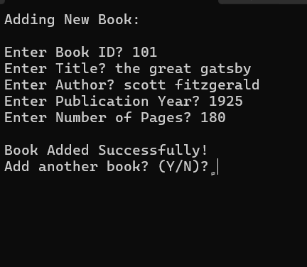
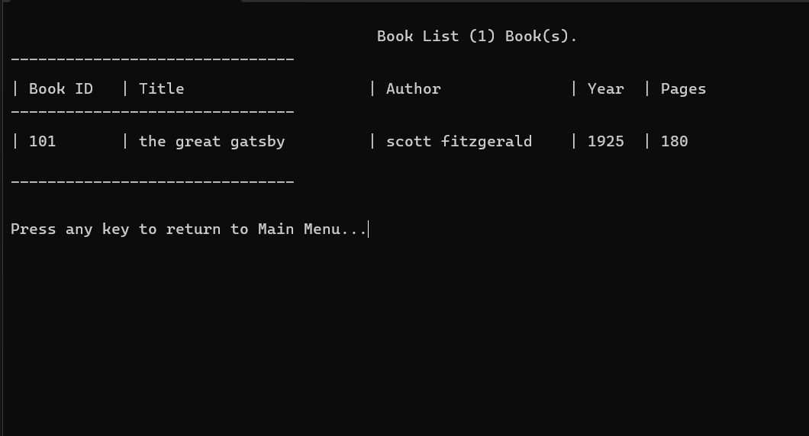
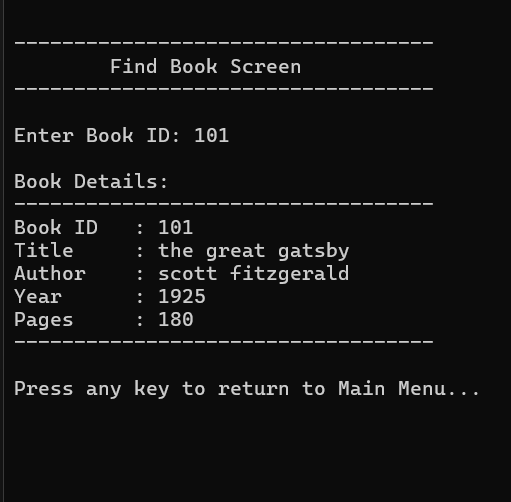

# Library-Management-System---C-.-C---
# Simple Library Management System - C++ Console Application

##  Overview
This project is a simple, console-based Library Management System developed using C++. It allows users to manage a collection of books with basic functionalities. The system uses a text file (`Books.txt`) for persistent data storage, ensuring that book information is saved and loaded across sessions.

---

## نظرة عامة
هذا المشروع هو نظام بسيط لإدارة المكتبات، تم تطويره باستخدام لغة C++. يسمح للمستخدمين بإدارة مجموعة من الكتب بوظائف أساسية. يستخدم النظام ملفًا نصيًا (`Books.txt`) لتخزين البيانات بشكل دائم، مما يضمن حفظ وتحميل معلومات الكتب عبر الجلسات.

---

##  Key Features

* **Comprehensive Book Lifecycle Management:**
    * **Add New Book:** Easily add new book records with unique IDs, titles, authors, publication years, and number of pages.
    * **Update Book:** Modify existing book details by their unique ID.
    * **Remove Book:** Delete book records from the system using their ID (logical deletion by marking as deleted).
* **Efficient Data Retrieval:**
    * **List All Books:** Display all stored books in a clear, formatted table.
    * **Find Book by ID:** Quickly search for and view details of a specific book using its unique ID.
* **Persistent Storage Solution:**
    * All book data is automatically saved to and loaded from a plain text file (`Books.txt`), ensuring data integrity and persistence.
* **Intuitive Console Interface:**
    * A user-friendly menu-driven interface guides users through various operations.
* **Unique Book ID Validation:**
    * Ensures that each new book added has a unique identifier to prevent data duplication.

---

##  الميزات الرئيسية

* **إدارة دورة حياة الكتاب الشاملة:**
    * **إضافة كتاب جديد:** يمكنك بسهولة إضافة سجلات كتب جديدة بمعرفات فريدة، عناوين، مؤلفين، سنوات نشر، وعدد صفحات.
    * **تحديث كتاب:** تعديل تفاصيل الكتب الموجودة باستخدام معرفها الفريد.
    * **إزالة كتاب:** حذف سجلات الكتب من النظام باستخدام معرفها (الحذف المنطقي عن طريق وضع علامة "محذوف").
* **استرجاع البيانات بكفاءة:**
    * **عرض جميع الكتب:** عرض جميع الكتب المخزنة في جدول منسق وواضح.
    * **البحث عن كتاب بالمعرف:** البحث السريع عن تفاصيل كتاب معين وعرضها باستخدام معرفه الفريد.
* **حل التخزين الدائم:**
    * يتم حفظ جميع بيانات الكتب تلقائيًا وتحميلها من ملف نصي عادي (`Books.txt`)، مما يضمن سلامة البيانات واستمراريتها.
* **واجهة تحكم سهلة الاستخدام:**
    * واجهة قائمة سهلة الاستخدام توجه المستخدمين عبر العمليات المختلفة.
* **التحقق من فرادة معرف الكتاب:**
    * يضمن أن كل كتاب جديد يتم إضافته له معرف فريد لمنع تكرار البيانات.

---

##  Technologies & Concepts Used

* **Programming Language:** C++
* **Data Structuring:** `struct` to define `sBook` objects for organizing book attributes.
* **Dynamic Collections:** `std::vector` for dynamic storage and management of `sBook` objects in memory.
* **File I/O:** `fstream` for reading from and writing to text files (`Books.txt`) to maintain persistent data.
* **String Manipulation:** Functions like `SplitString` for parsing data from file, `to_string`, and `getline` for robust input handling.
* **Core Operations:** Implementation of CRUD (Create, Read, Update, Delete) operations.
* **User Experience:** Use of `iomanip` for formatted output and `system("cls")` for clearing the console, enhancing readability.

---

##  التقنيات والمفاهيم المستخدمة

* **لغة البرمجة:** C++
* **هيكلة البيانات:** `struct` لتعريف كائنات `sBook` لتنظيم سمات الكتاب.
* **المجموعات الديناميكية:** `std::vector` للتخزين الديناميكي وإدارة كائنات `sBook` في الذاكرة.
* **إدخال/إخراج الملفات (File I/O):** `fstream` للقراءة والكتابة من وإلى الملفات النصية (`Books.txt`) للحفاظ على البيانات الدائمة.
* **معالجة النصوص (String Manipulation):** دوال مثل `SplitString` لتحليل البيانات من الملف، `to_string`، و `getline` للتعامل القوي مع المدخلات.
* **العمليات الأساسية:** تطبيق عمليات CRUD (إنشاء، قراءة، تحديث، حذف).
* **تجربة المستخدم:** استخدام `iomanip` للإخراج المنسق و`system("cls")` لمسح شاشة الأوامر، مما يعزز سهولة القراءة.

---

##  How It Works

The application operates through a main menu from which users can select various operations.
1.  **Data Loading:** Upon startup, the system attempts to load existing book records from `Books.txt` into an `std::vector<sBook>` in memory.
2.  **User Interaction:** Users interact with the system via console input, choosing options like adding, listing, updating, or deleting books.
3.  **Data Management:** All operations are performed on the `sBook` objects stored in the `std::vector`.
4.  **Persistent Saving:** After each significant change (add, update, delete), the updated `std::vector` is saved back to `Books.txt`, overwriting the previous content to ensure all changes are permanently stored. Logical deletion is implemented, meaning books are marked as deleted but remain in the file until a full save overwrites them, or until specific clean-up.

---

##  كيفية عمل البرنامج

يعمل التطبيق من خلال قائمة رئيسية يمكن للمستخدمين من خلالها اختيار عمليات مختلفة.
1.  **تحميل البيانات:** عند بدء التشغيل، يحاول النظام تحميل سجلات الكتب الموجودة من `Books.txt` إلى `std::vector<sBook>` في الذاكرة.
2.  **تفاعل المستخدم:** يتفاعل المستخدمون مع النظام عبر إدخال الأوامر في شاشة الأوامر، واختيار خيارات مثل إضافة الكتب، عرضها، تحديثها، أو حذفها.
3.  **إدارة البيانات:** يتم تنفيذ جميع العمليات على كائنات `sBook` المخزنة في `std::vector`.
4.  **الحفظ الدائم:** بعد كل تغيير مهم (إضافة، تحديث، حذف)، يتم حفظ `std::vector` المحدّث مرة أخرى في `Books.txt`، ليحل محل المحتوى السابق لضمان تخزين جميع التغييرات بشكل دائم. يتم تطبيق الحذف المنطقي، مما يعني أن الكتب يتم تعليمها كمحذوفة ولكنها تبقى في الملف حتى يتم حفظ كامل يحل محلها، أو حتى يتم تنظيف معين.

---

##  Setup and Run

To set up and run this project locally:

1.  **Clone the repository:**
    ```bash
    git clone [https://github.com/shahalabdulno/Library-Management-System---C-.C---.git](https://github.com/shahalabdulno/Library-Management-System---C-.C---.git)
    ```
2.  **Navigate to the project directory:**
    ```bash
    cd Library-Management-System---C-.C---
    ```
3.  **Compile the code:**
    * **Using g++ (MinGW/Linux):**
        ```bash
        g++ "smart task.cpp" -o library_manager
        ```
        *(Make sure you have g++ installed. If your main file is named differently, replace `smart task.cpp` with its actual name).*
    * **Using Visual Studio:**
        * Open the `.sln` file in Visual Studio.
        * Build the solution.
4.  **Run the executable:**
    * **Using g++:**
        ```bash
        ./library_manager
        ```
    * **Using Visual Studio:**
        * Run the compiled executable directly from the Debug/Release folder, or through Visual Studio's Run button.

---

##  الإعداد والتشغيل

لإعداد وتشغيل هذا المشروع محليًا:

1.  **استنساخ المستودع (Clone the repository):**
    ```bash
    git clone [https://github.com/shahalabdulno/Library-Management-System---C-.C---.git](https://github.com/shahalabdulno/Library-Management-System---C-.C---.git)
    ```
2.  **انتقل إلى دليل المشروع:**
    ```bash
    cd Library-Management-System---C-.C---
    ```
3.  **تجميع الكود (Compile the code):**
    * **باستخدام g++ (MinGW/Linux):**
        ```bash
        g++ "smart task.cpp" -o library_manager
        ```
        *(تأكد من تثبيت g++. إذا كان ملفك الرئيسي يحمل اسمًا مختلفًا، استبدل `smart task.cpp` باسمه الفعلي).*
    * **باستخدام Visual Studio:**
        * افتح ملف `.sln` في Visual Studio.
        * قم ببناء الحل (Build the solution).
4.  **تشغيل الملف التنفيذي:**
    * **باستخدام g++:**
        ```bash
        ./library_manager
        ```
    * **باستخدام Visual Studio:**
        * شغل الملف التنفيذي المجمع مباشرة من مجلد Debug/Release، أو من خلال زر التشغيل في Visual Studio.

---

##  Screenshots (لقطات شاشة)
### Main Menu


### Add New Book


### All Books List


### Find Book Details

